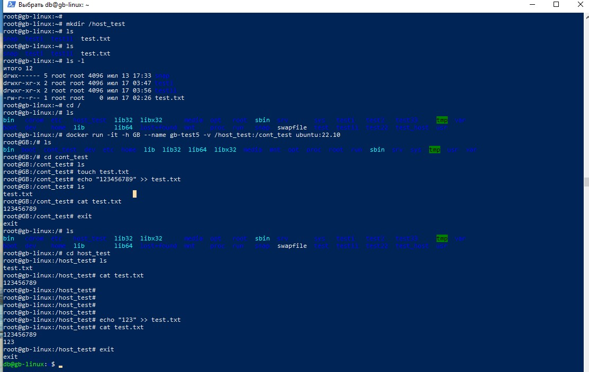

Задание:
● Создать папку, которую мы будем готовы смонтировать в контейнер
● В этой папке создать файл test.txt и наполнить данными
● В домашней директории создать файл test.txt, который также необходимо будет смонтировать в контейнер и наполнить совершенно другими данными
● Создать контейнер из образа ubuntu:22.04 (Задать ему имя и задать hostname). Смонтировать созданную ранее папку с хоста в контейнер
● Смонтировать созданный ранее текстовый файл внутрь смонтированной папки, чтобы он пересекался с созданным ранее файлом в этой папке. Просмотреть этот файл.
Все пункты выше обязательны!

Решение :

Создаем папку
mkdir /host_test

Создаем контейнер и подвязываем нашу папку host_test с папкой cont_test, которая создаться при запуске контейнера
docker run -it -h GB --name gb-test5 -v /host_test:/cont_test ubuntu:22.10

Заходим в папку cont_test в нащ=шем контейненер и создаем файл test.txt и меняем в нем содиржимое
touch test.txt

echo "123456789" >> test.txt

Выходим из контейнера exit

Проверяем наш файл в папке host_test

cd host_test

cat test.txt

Студент Мусатова А.С. , дз к семинару 3 Контейнеризация 